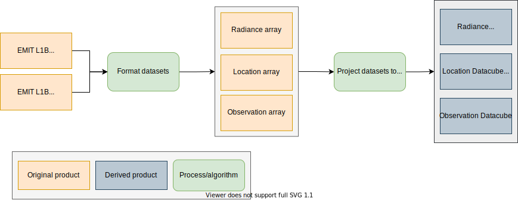

# SISTER Preprocess PGE Documentation

## Description

The L1B preprocess PGE takes as input imaging spectroscopy datasets in their native formats and converts them to a common set of file types for downstream processing. Currently, preprocessing is supported for four sensors:

- AVIRIS Classic
- AVIRIS Next Generation
- DESIS
- PRISMA
- EMIT

Processing steps vary by sensor and are descibed below.

### AVIRIS Classic (AVCL)

---

Input data for AVCL is a tar'ed and gzipped archived containing multiple ENVI formated datasets, including radiance, geolocation and geometry data.

File example:

	f080709t01p00r15.tar.gz

Preprocessing of AVCL data includes application of radiance gains to generate radiance data in the units of microwatts per centimeter squared per steradian (μW/cm2/sr). Preprocessing of AVCL also includes optional spatial resampling. Spatial resampling is performed by aggregationg and averaging pixels to the closest resolution to the target resolution. For example, for a target pixel size of 30m and source pixel size of 16m, pixels will be averaged in 2x2 blocks of pixels for an output resolution of 30m.

### AVIRIS Next Generation (AVNG)

---

Input data for AVNG is a tar'ed and gzipped archived containing multiple ENVI formated datasets, including radiance, geolocation and geometry data.

File example:

		ang20191027t204454.tar.gz

Preprocessing of AVNG also includes optional spatial resampling. Spatial resampling is performed by aggregationg and averaging pixels to the closest resolution to the target resolution. For example, for a target pixel size of 30m and source pixel size of 5.6m, pixel will be averaged in 5x5 blocks of pixels for an output resolution of 28m.

### DESIS (DESIS)

---

DESIS L1C radiance data are provided by the German Space Agency (DLR) and Teledyne as a zipped archive containing radiance data in a GeoTIFF file along with metadata in an XML file.

Example file:

		DESIS-HSI-L1C-DT0700655132_004-20220317T070333-V0215.zip

Provided band gains and offsets are using to convert radiance data to physical units of μW/cm2/sr. Per-pixel sensor geometry data is not provided, instead a scene mean value is included in the metadata, this value is assigned to all pixels in the image. Per-pixel solar geometry is calculated at the start time of image collection. An elevation dataset is not provided with DESIS imagery and is generated during runtime. Copernicus DEM tiles that overlap the DESIS image extent are downloaded from AWS servers (['https://copernicus-dem-30m.s3.amazonaws.com/']('https://copernicus-dem-30m.s3.amazonaws.com/')), mosiacked and clipped to the geographic extent of the input dataset.

### PRISMA (PRISMA)

---

PRISMA L1 radiance data are provided by the Italian Space Agency (ASI) as a zipped HDF file containing unprojected radiance, pixel geolocation data and sensor and solar geometry data.

Example file:

		PRS_L1_STD_OFFL_20210204092812_20210204092816_0001.zip

Prior to data export a series of correction routines are applied to the dataset to improve geometric registration and radiometry. First a smile correction is applied by resampling the radiance data using a precalculated wavelength center array, next a pseudo flat field correction is applied to the radiance data using a precalculated array of radiometric adjustment coefficients. Using the input Landsat image as a reference image pixel coordinates are then adjusted using an image matching algorithm. An elevation dataset is not provided with PRISMA imagery and is generated during runtime. Copernicus DEM tiles that overlap the PRISMA image extent are downloaded from AWS servers (['https://copernicus-dem-30m.s3.amazonaws.com/']('https://copernicus-dem-30m.s3.amazonaws.com/')), mosiacked and clipped to the geographic extent of the input dataset. Finally all datasets are projected in the appropriate WGS84 UTM zone at a spatial resolution of 30m.

### EMIT

---

EMIT L1B radiance and observation datasets are provided by the National Aeronautics and Space Administration (NASA) in NetCDF format and contain radiance, per-pixel coordinates, elevation and sensor and solar geometry data.

File examples:

	EMIT_L1B_RAD_001_20220826T065459_2223805_009.nc
	EMIT_L1B_OBS_001_20220826T065459_2223805_009.nc
 
EMIT datasets are first converted to ENVI formatted files and then projected to Universal Transverse Mercator (UTM) using the provided per-pixel geographic coordinates at 60m resolution.

## PGE Arguments

The L1 preprocess PGE takes the following arguments:

| Argument           | Description                          | Default |
|--------------------|--------------------------------------|---------|
| radiance_data      | URL to input radiance data file      | -       |
| radiance_header    | URL to input radiance header         | None    |
| observation_data   | URL to input observation data file   | None    |
| observation_header | URL to input observation header      | None    |
| location_data      | URL to input location data file      | None    |
| location_header    | URL to input location header         | None    |
| glt_data           | URL to input GLT data file           | None    |
| glt_header         | URL to input GLT header              | None    |
| crid               | Composite release identifier         | '000'   |
| experimental       | Designates outputs as "experimental" | 'True'  |

## Outputs

The outputs of the L1B preprocess PGE use the following naming convention:

     (EXPERIMENTAL-)SISTER_<SENSOR>_L1B_RDN_<YYYYMMDDTHHMMSS>_<CRID>_<SUBPRODUCT>

Note that the "EXPERIMENTAL-" prefix is optional and is only added when the "experimental" flag is set to True.

The following data products are produced:

| Product description                     | Units                             | Example filename                                            |
|-----------------------------------------|-----------------------------------|-------------------------------------------------------------|
| ENVI Radiance datacube                  | μW/cm2/sr              | SISTER\_AVNG\_L1B\_RDN\_20220502T180901\_001                |
| ENVI Radiance header file               | -                                 | SISTER\_AVNG\_L1B\_RDN\_20220502T180901\_001.hdr            |
| ENVI Radiance metadata (STAC formatted) | -                                 | SISTER\_AVNG\_L1B\_RDN\_20220502T180901\_001.json           |
| False color radiance quicklook          | -                                 | SISTER\_AVNG\_L1B\_RDN\_20220502T180901\_001.png            |
| ENVI Location datacube                  | -                                 | SISTER\_AVNG\_L1B\_RDN\_20220502T180901\_001_LOC.bin        |
| 1. WGS-84 longitude                     | decimal degrees                   |                                                             |
| 2. WGS-84 latitude                      | decimal degrees                   |                                                             |
| 3. Ground elevation                     | meters                            |                                                             |
| ENVI Location header file               | -                                 | SISTER\_AVNG\_L1B\_RDN\_20220502T180901\_001_LOC.hdr        |
| ENVI Location metadata (STAC formatted) | -                                 | SISTER\_AVNG\_L1B\_RDN\_20220502T180901\_001_LOC.json       |
| ENVI Observation datacube               | -                                 | SISTER\_AVNG\_L1B\_RDN\_20220502T180901\_001_OBS.bin        |
| 1. path length                          | meters                            |                                                             |
| 2. to-sensor-azimuth                    | 0 to 360 degrees clockwise N      |                                                             |
| 3. to-sensor-zenith                     | 0 to 90 degrees from zenith       |                                                             |
| 4. to-sun-azimuth                       | 0 to 360 degrees clockwise N      |                                                             |
| 5. to-sun-zenith                        | 0 to 90 degrees from zenith       |                                                             |
| 6. solar phase                          | degrees                           |                                                             |
| 7. slope                                | decimal degrees                   |                                                             |
| 8. aspect                               | 0 to 360 degrees clockwise from N |                                                             |
| 9. cosine i                             | unitless                          |                                                             |
| 10. UTC time                            | decimal hours                     |                                                             |
| 11. Earth-sun distance                  | astronomical unit                 |                                                             |
| ENVI Observation header file            | -                                 | SISTER\_AVNG\_L1B\_RDN\_20220502T180901\_001_OBS.hdr        |
| Observation metadata (STAC formatted)   | -                                 | SISTER\_AVNG\_L1B\_RDN\_20220502T180901\_001_OBS.json       |
| PGE runconfig                           | -                                 | SISTER\_AVNG\_L1B\_RDN\_20220502T180901\_001.runconfig.json |
| PGE log                                 | -                                 | SISTER\_AVNG\_L1B\_RDN\_20220502T180901\_001.log            |

File and band descriptions taken directly from [AVIRIS NG Data Product Readme]
(https://avirisng.jpl.nasa.gov/dataportal/ANG_L1B_L2_Data_Product_Readme_v02.txt)

Metadata files are [STAC formatted](https://stacspec.org/en) and compatible with tools in the [STAC ecosystem](https://stacindex.org/ecosystem).

## Executing the Algorithm

This algorithm requires [Anaconda Python](https://www.anaconda.com/download)

To install and run the code, first clone the repository and execute the install script:

    git clone https://github.com/sister-jpl/sister-preprocess.git
    cd sister-preprocess
    ./install.sh
    cd ..

Then, create a working directory and enter it:

    mkdir WORK_DIR
    cd WORK_DIR

Copy input files to the work directory and run the code.  Note that there are two ways to call inputs.  If the input data is 
a single file (in the case of EMIT, DESIS, or PRISMA) then just pass in the `--radiance_data` parameter and the input file:

    ../sister-preprocess/pge_run.sh --radiance_data RADIANCE_FILE

If the input data is composed of separate files (AVIRIS and AVIRIS-NG), then pass in each file separately:

    ../sister-preprocess/pge_run.sh --radiance_data RADIANCE_DATA --radiance_header RADIANCE_HEADER --observation_data OBSERVATION_DATA --observation_header OBSERVATION_HEADER --location_data LOCATION_DATA --location_header LOCATION_HEADER --glt_data GLT_DATA --glt_header GLT_HEADER
